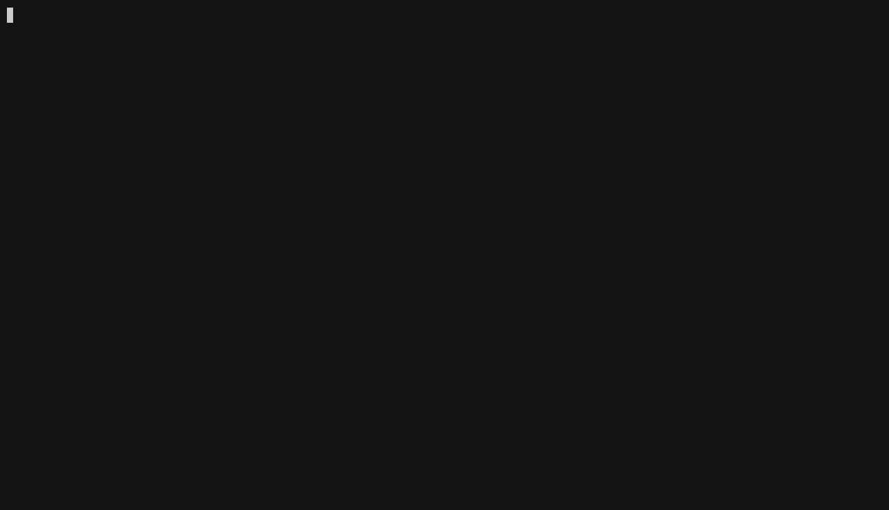

# csessions

See every Claude Code session on every machine you use, from the terminal.



*Browsing sessions across two machines. A [second clip](demo/csessions-new.gif)
shows starting a new session.*

Claude Code already aggregates your sessions across machines in the desktop app,
claude.ai and the phone. The CLI never got that view: `claude agents --json` only
knows about the machine it runs on. `csessions` fills that gap.

It is an **observer**, not a launcher. It reads Claude Code's own on-disk state,
so it finds sessions you started anywhere: a terminal, the desktop app, or your
phone over Remote Control. Other session managers wrap tmux and can only show
you the sessions they themselves created.

```
 ▐▛███▜▌   ╭─ ACCOUNT ─────────────────────────────╮
▝▜█████▛▘  │ ◆ you@example.com                     │
  ▘▘ ▝▝    │ Max 5x                                │
 v2.1.276  ├─ SESSIONS ────────────────────────────┤
           │ 121 sessions · 5 active · 21 remote   │
           ├─ STATS ───────────────────────────────┤
           │ today     147M tok    ~$85            │
           │ 7 days    6.8B tok    ~$4,872         │
           ├─ LIMITS ──────────────────────────────┤
           │ 5H ████░░░░░░░░  34%  00:59           │
           │ 7D ██████████░░  85%  Sep 22 04:00    │
           ├─ NEW ─────────────────────────────────┤
           │ + New session   (click, or ctrl-n)    │
           ╰───────────────────────────────────────╯

  sessions, most recently active first

today ───────────────────────────────────────────────
✳ Refactor the billing adapter
   work  background   working     2m ago     started 7h  ✆ remote

○ Proposed new architecture
   local closed       -          29m ago     started 29m

yesterday ───────────────────────────────────────────
◐ Output style formatting
   local background   blocked     2h ago     started 2h  ✆ remote
```

## What it shows that the CLI can't

- **Every machine in one list.** Local plus any SSH host you name.
- **Remote Control attachment** (`✆ remote`): which sessions you can drive from
  claude.ai or the phone right now. Claude Code tracks this internally but
  strips it from `claude agents --json`.
- **Closed sessions.** Once a session exits, the daemon forgets it. csessions
  recovers it from its transcript, with the title Claude gave it.
- **A conversation preview**, with the harness noise (skill bodies, command
  preambles, system reminders) filtered out.
- **Token usage and cost** for today, the last 7 days and the last 30 days, priced per model.

## Install

Requires Python 3.9+, [fzf](https://github.com/junegunn/fzf) 0.60+, and Claude
Code. Remote hosts need Claude Code and key-based SSH.

```sh
git clone https://github.com/<you>/csessions.git
install -m 755 csessions/csessions ~/.local/bin/csessions
```

## Configure

Optional. Without a config it lists this machine only.

```sh
mkdir -p ~/.config/csessions
cp config.example.json ~/.config/csessions/config.json
```

```json
{
  "hosts": { "local": null, "work": "me@10.0.0.5" },
  "prefixes": { "work": "Work - " },
  "refresh": 5,
  "preview_width": 40,
  "terminal": "iTerm"
}
```

`hosts` maps a label to an SSH target, or `null` for this machine. `prefixes` is
display only: it labels a host's sessions in the list without touching their
real titles.

## Keys

| | |
|---|---|
| type | fuzzy search |
| click, arrows | select a session and open the preview |
| enter, double-click | open the session in a new terminal window |
| esc, left arrow | close the preview; esc again quits |
| ctrl-n | start a session, choosing host and working directory |
| ctrl-r | refresh now |

`csessions -l` prints a plain list instead, for scripts.

## Optional extras

In [`extras/`](extras), documented in [extras/README.md](extras/README.md):
a macOS app bundle that opens the list in its own window, an icon generator,
and a tiling hook. The tiling hook is off unless you set `tile_shortcut`.

## How it works, and what that costs you

csessions reads files Claude Code does not document:

- `~/.claude/sessions/<pid>.json` for live sessions and Remote Control state
- `~/.claude/projects/*/*.jsonl` for titles, previews and token usage
- `claude agents --json` for the daemon's own view

**Expect this to break when Claude Code changes.** Verified against
**2.1.276**. If a release moves any of the above, csessions degrades to showing
less rather than crashing, but it will need fixing.

It only reads. Nothing in the core writes to Claude Code's files.

Transcripts contain your conversations. csessions reads them to build previews
and count tokens, and sends nothing anywhere: remote hosts are queried over your
own SSH, and everything else stays on your machine.

The dollar figures are what your usage **would cost on the API**. On a
subscription you are not billed that. They are a sense of scale, not an invoice.

## Licence

MIT
